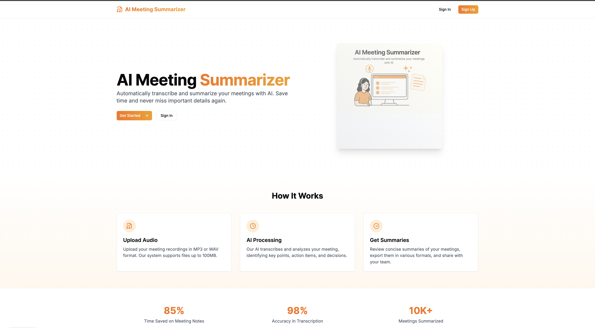
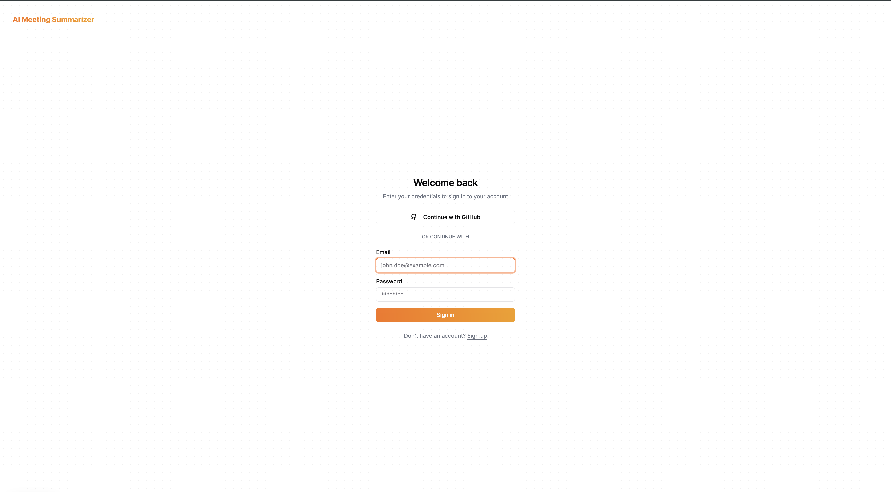
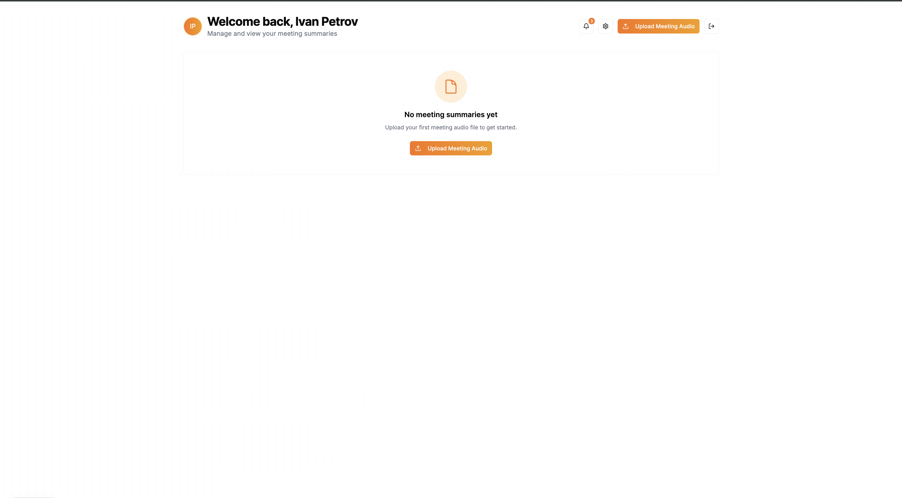
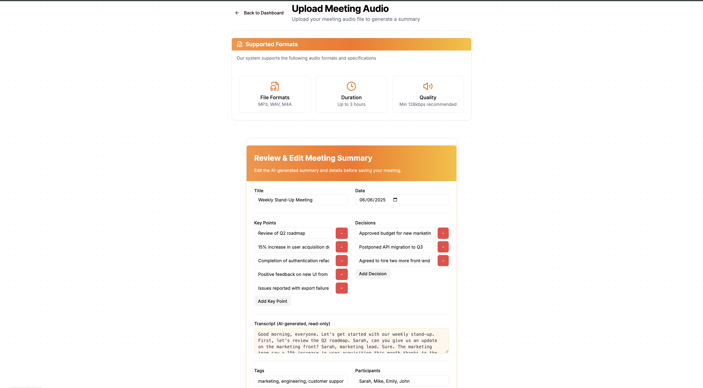
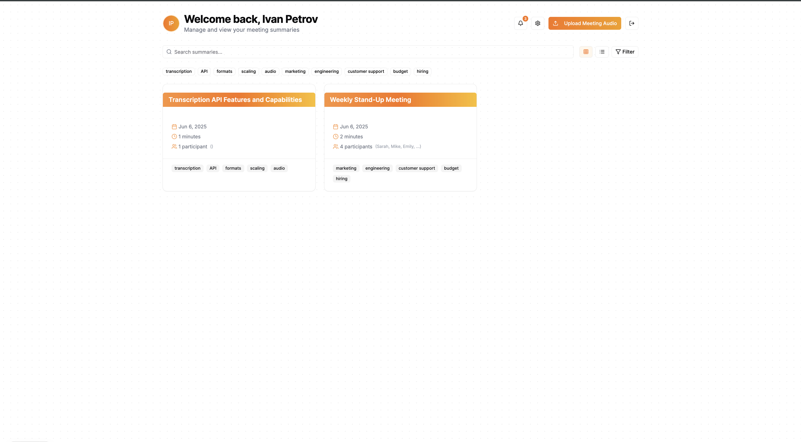
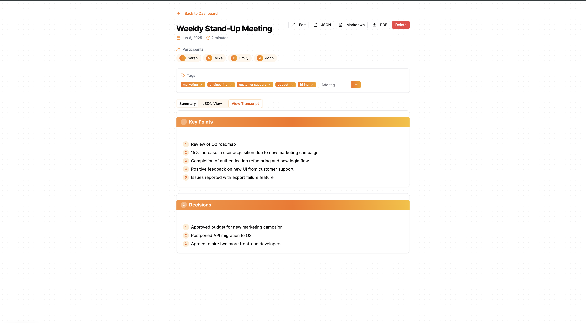

# 🤖 AI Meeting Summarizer

> Transform your meeting recordings into structured, actionable summaries using AI.

## 🔗 Project Link

Project Link: [https://ai-meeting-summarizer-pi.vercel.app](https://ai-meeting-summarizer-pi.vercel.app/)

## 📸 Screenshots

 

## ✨ Features

- 🎙️ **Audio Transcription**: Upload and transcribe .mp3 or .wav meeting recordings
- 🤖 **AI-Powered Summaries**: Extract key points, decisions, and action items
- 🔖 **Tag & Organize**: Save and categorize your meeting summaries
- 📤 **Multiple Export Formats**: Export as JSON, Markdown, or PDF
- 🔐 **Secure Authentication**: Sign in with GitHub or email/password
- 📱 **Responsive Design**: Works seamlessly on all devices

## 🚀 Tech Stack

- **Frontend**: Next.js 15 (App Router), TypeScript, Tailwind CSS, shadcn/ui
- **Backend**: tRPC, Prisma, PostgreSQL (via Neon)
- **Authentication**: NextAuth.js
- **AI Integration**: Vercel AI SDK (OpenAI)
- **Package Manager**: pnpm

## 🛠️ Getting Started

### Prerequisites

- Node.js 20+
- pnpm
- PostgreSQL database (or Neon account)
- OpenAI API key

## 📝 Usage

1. Sign in using GitHub or email/password
2. Upload your meeting recording (.mp3 or .wav)
3. Wait for the AI to transcribe and summarize
4. Review, edit, and save your summary
5. Export in your preferred format

## 📄 License

This project is licensed under the MIT License.

